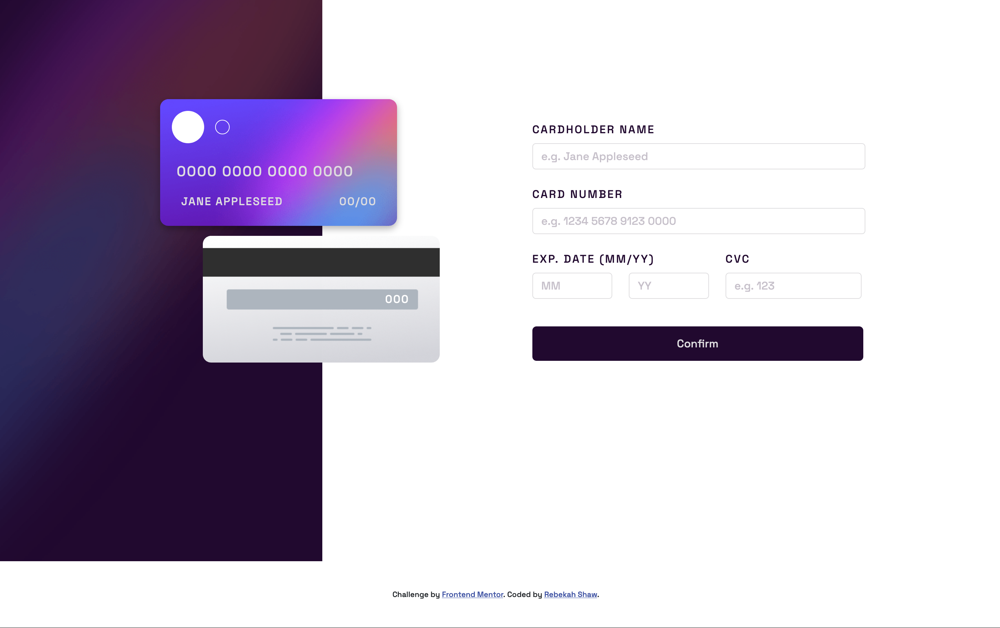
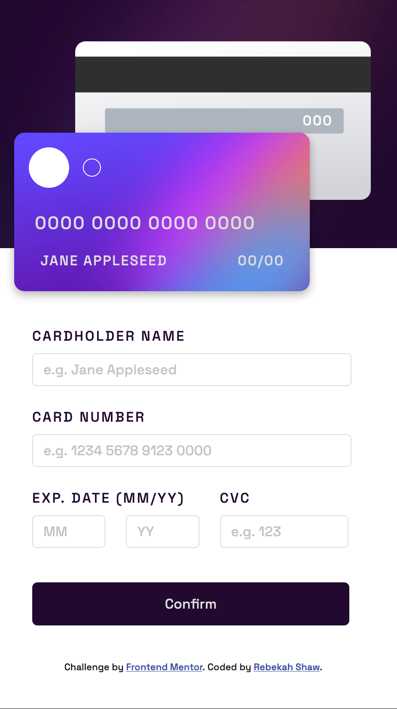

# Frontend Mentor - Interactive card details solution

This is a solution to the [Interactive card details form challenge on Frontend Mentor](https://www.frontendmentor.io/challenges/interactive-card-details-form-XpS8cKZDWw). Frontend Mentor challenges help you improve your coding skills by building realistic projects. 

## Table of contents

- [Overview](#overview)
  - [The challenge](#the-challenge)
  - [Screenshot](#screenshot)
  - [Links](#links)
- [My process](#my-process)
  - [Built with](#built-with)
  - [What I learned](#what-i-learned)
  - [Continued development](#continued-development)
  - [Useful resources](#useful-resources)
- [Author](#author)

## Overview

### The challenge

Users should be able to:

- Fill in the form and see the card details update in real-time
- Receive error messages when the form is submitted if:
  - Any input field is empty
  - The card number, expiry date, or CVC fields are in the wrong format
- View the optimal layout depending on their device's screen size
- See hover, active, and focus states for interactive elements on the page

### Screenshot

#### Desktop

#### Mobile

### Links

- Solution URL: [ Solution](https://github.com/rebekahshaw92//interactive-card-details-form)
- Live Site URL: [Live Site](https://rebekahshaw92.github.io//interactive-card-details-form)

### Built with

- Semantic HTML5 markup
- CSS custom properties
- Sass
- JavaScript
- Bootstrap 5
- Mobile-first workflow

### What I Learned

Through doing this project I had the chance to learn more about working with forms along with JavaScript. I also learned how to add a linear-gradient bored to a form input.

### Continued Development

I would like to continued working both with JavaScript and Bootstrap 5.

### Userful Resources 

- [Bootstrap](https://getbootstrap.com) - This site helped me learn all I needed to know about Bootstrap.

## Author

- Website - [Rebekah Shaw](https://www.rebekahshaw.com)
- Frontend Mentor - [@rebekahshaw92](https://www.frontendmentor.io/profile/rebekahshaw92)
- Twitter - [@x_beckyboo_x](https://www.twitter.com/x_beckyboo_x)
